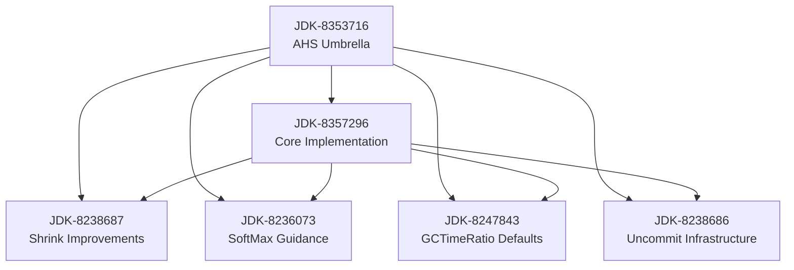

# G1 AHS Core Implementation

> This document describes the core implementation of G1 AHS (JDK-8357296). It serves as the canonical documentation for both OpenJDK development and external contributors.

_Last Updated: May 20, 2025_

## Overview

The G1 AHS core implementation (JDK-8357296) workstream provides intelligent heap sizing by coordinating multiple G1 GC subsystems. This document describes how JDK-8357296 fits into the broader G1 AHS project under the umbrella JDK-8353716.

For detailed design discussions and principles, see:

- `AHS-Principles.md` - Core design principles and rationale
- `02-control-loop-design.md` - Control loop architecture and algorithms
- `State-of-AHS-for-G1.md` - Project history and evolution

## Goals
- Optimize heap size based on workload characteristics
- Enforce soft maximum heap size limits
- Coordinate garbage collection timing
- Provide stable, thread-safe operation

## Component Dependencies



## Core Implementation Role (JDK-8357296)

Our implementation provides the central coordination mechanism that integrates all other AHS components:

1. Integration Points:
- Coordinates SoftMax policy (JDK-8236073) with heap sizing decisions
- Applies GCTimeRatio targets (JDK-8247843) in control loop
- Triggers shrink decisions (JDK-8238687) based on GC metrics
- Schedules memory uncommit (JDK-8238686) when appropriate

2. Key Files Modified:
```
g1HeapSizingPolicy.{cpp,hpp} - Core control loop implementation
g1_globals.hpp              - AHS configuration framework
```

3. Runtime Controls:
```cpp
//Primary controls
GCTimeRatio           - GC vs application time ratio
GCCpuOverheadTarget   - Direct CPU target percentage
SoftMaxHeapSize       - Soft maximum heap size limit

//Tuning parameters
G1AHSDampingFactor    - Control loop response damping
G1UncommitDelay       - Memory uncommit delay time
```

## Integration with Other Components

1. Shrink Improvements (JDK-8238687):
- Provides base shrink mechanism
- Our changes add:
  * Coordination with GC CPU targets
  * Integration with SoftMax limits
  * Uncommit scheduling logic

2. SoftMax Guidance (JDK-8236073):
- Defines SoftMax policy
- Our changes add:
  * Runtime enforcement
  * IHOP coordination
  * Adaptive growth limits

3. GCTimeRatio Defaults (JDK-8247843):
- Sets baseline targets
- Our changes add:
  * Runtime adjustment logic
  * CPU overhead monitoring
  * Adaptive response

4. Uncommit Infrastructure (JDK-8238686):
- Provides memory management
- Our changes add:
  * Trigger conditions
  * Coordination with sizing
  * Safety mechanisms

## Why Core Implementation is Critical

The core implementation in JDK-8357296 is essential because:

1. Central Coordination:
- Acts as the "brain" coordinating all AHS components
- Provides consistent decision making
- Ensures proper component interaction

2. Integration Layer:
- Connects independent mechanisms
- Provides consistent API
- Manages state transitions

3. Policy Enforcement:
- Applies configured limits
- Maintains safety constraints
- Prevents conflicting decisions

Without JDK-8357296, the other components would:
- Operate independently
- Lack coordination
- Miss high-level policy goals
- Risk conflicting actions

## Implementation Status

### Phase 1 (Current)
- Core control loop implementation ✓
- Basic workload adaptation ✓
- Thread safety mechanisms ✓
- SoftMax enforcement ✓

### Phase 2 (Planned)
- Full GCTimeRatio integration
- Enhanced adaptation logic
- Legacy control removal
- Runtime management via JMX

### Phase 3 (Future)
- Container integration
- Advanced workload adaptation
- Performance guarantees
- Extended metrics

## Testing Strategy

The test implementation follows HotSpot testing guidelines:

1. Component Testing
- Individual mechanism verification
- Statistical validation
- Safety verification

2. Integration Testing
- Cross-component coordination
- State transition validation
- Error handling

3. Performance Testing
- Throughput validation
- Latency measurements
- Edge case behavior

## References

- [JDK-8353716](https://bugs.openjdk.org/browse/JDK-8353716): G1 AHS Umbrella
- [JDK-8357296](https://bugs.openjdk.org/browse/JDK-8357296): G1 AHS Core Implementation
- [JDK-8238687](https://bugs.openjdk.org/browse/JDK-8238687): G1 Shrink Improvements
- [JDK-8236073](https://bugs.openjdk.org/browse/JDK-8236073): G1 SoftMax Guidance
- [JDK-8247843](https://bugs.openjdk.org/browse/JDK-8247843): G1 GCTimeRatio Defaults
- [JDK-8238686](https://bugs.openjdk.org/browse/JDK-8238686): G1 Uncommit Infrastructure
- [Documentation](https://github.com/microsoft/openjdk-workstreams/tree/main/G1-AHS)
