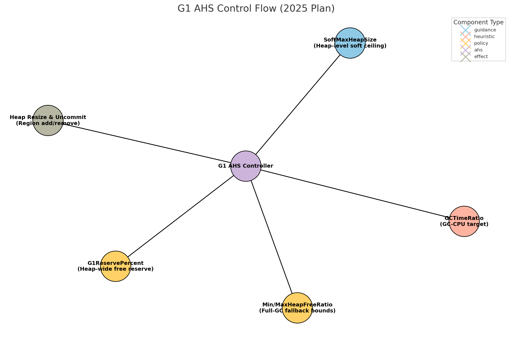

 # Design Note 02 – Control-Loop Design  
_Compiled by **Monica Beckwith** • May 2025_

---

## 1  Purpose & Scope
This note formalizes the **closed-loop algorithm** that will drive **G1’s Automatic Heap Sizing (AHS)** once the current patch set  
([JDK-8238686](https://bugs.openjdk.org/browse/JDK-8238686), [-8238687](https://bugs.openjdk.org/browse/JDK-8238687), [-8247843](https://bugs.openjdk.org/browse/JDK-8247843), [PR #24211](https://github.com/openjdk/jdk/pull/24211), …) lands.

It explains:  
* which **inputs** are sampled at each GC,  
* how those inputs are **fused into a heap-size target**,  
* and how the target is **enforced** by region commit / uncommit.



---

## 2  Signals & Guard-rails

| **Category**        | **Signal**                                | **Role in the Loop**                                         | **Guidance**                       |
|---------------------|-------------------------------------------|-------------------------------------------------------------|-------------------------------------|
| **Soft ceiling**    | `SoftMaxHeapSize` (bytes)                 | Upper bound – IHOP & resize policy try not to exceed it.     | Tune for footprint-sensitive apps. |
| **Primary feedback**| `GCTimeRatio` (float, runtime-manageable) | Desired % of CPU spent in GC (GC-CPU share).                | Default 24; expose as runtime flag.|
| **Safety floor**    | `G1ReservePercent` (% free regions)       | Guarantees at least *R* free regions for evacuation; never shrink below this. | Keep ≥10 % in production.          |
| **Legacy bounds**   | `MinHeapFreeRatio` / `MaxHeapFreeRatio`   | Consulted only after **Full GC** for predictable footprint trimming.         | Retained for legacy tunings.       |

> **Conversion** `GCTimeRatio_target = 1 / (GCTimeRatio + 1)` (e.g. 24 → 4 % GC‑CPU).

---

## 3  Measured Metrics (per GC)

| Name                  | Definition                                               |
|-----------------------|----------------------------------------------------------|
| **Observed GC-CPU %** | `T_gc / (T_gc + T_mut)` for the last interval.           |
| **LiveBytes**         | Sum of live data reported by the last marking phase.     |
| **YoungAllocRate**    | Bytes promoted + survivor + eden since previous GC.      |

---

## 4  Algorithm (per GC, end-of-pause)

1. **Update instrumentation** (alloc rate, GC-CPU).  
2. **Heap-size target from GC-CPU**  
   ```
   // Convert user flag once:
   GCTimeRatio_target = 1.0 / (GCTimeRatio + 1.0)   // 24 → 0.04 (4 %)

   target = committed_bytes * (Observed_GC_CPU / GCTimeRatio_target)^α
   // α = damping constant (0 < α ≤ 1); tune empirically
   ```
3. **Apply `SoftMaxHeapSize`**  
   `target = min(target, SoftMaxHeapSize)`
4. **Apply safety floor**  
   ```
   min_heap = live_bytes + reserve_regions * region_size
   target   = max(target, min_heap)
   ```
5. **Quantize to regions**  
   `target_regions = ceil(target / region_size)`
6. **Commit / Uncommit plan**  
   * If `committed_regions > target_regions` → schedule `N` region uncommit tasks (JDK-8238686).  
   * Else → allow allocation-driven commit (no special action).
7. **Update IHOP**  
   ```
   IHOP_target = min(target * StartOccupancyPercent / 100, SoftMaxHeapSize)
      ```
   > *StartOccupancyPercent* = IHOP “start marking” threshold (%) discussed in JEP 307 (default ≈ 45 %).

---

## 5  Reference Pseudocode

```cpp
void G1AHSController::update_after_gc(const GCStats& s) {
    double gc_cpu   = s.gc_time / s.total_time;
    double factor   = pow(gc_cpu / GCTimeRatio_target, alpha);   // α = damping constant
    size_t target   = committed_bytes * factor;

    target = MIN2(target, SoftMaxHeapSize);
    target = MAX2(target, live_bytes + reserve_bytes());

    size_t target_regions = align_up(target, region_size) / region_size;

    if (committed_regions > target_regions) {
        schedule_uncommit(committed_regions - target_regions);
    }
    // else: normal expansion on demand
    update_IHOP(target_regions * region_size);
}
```

---

## 6  Stability & Hysteresis

* **α damping** prevents saw-tooth oscillation across consecutive GCs.  
* **`G1UncommitDelay`** (default = 5 min) throttles rapid RSS shrink bursts.  
* `Min/MaxHeapFreeRatio` at Full GC provides long-period hysteresis for bursty legacy workloads.

---

## 7  Open Questions / Future Work
1. Adaptive **`G1ReservePercent`** – derive reserve from recent survivor + promotion volumes.  
2. Supersede integer **`GCTimeRatio`** with `-XX:GCCpuOverheadTarget=<float>%`.  

---

## 8  Relationship to Other Docs
* **AHS-Principles.md** – strategic overview & signal hierarchy.  
* **State-of-AHS.md** – current status, positions, and roadmap.  
* **Graphs/**  
   * `G1-Control-Flow-2025.png` – visualizes the closed‑loop algorithm.
   * `G1-Shrink-Dependency-2025.png` – code‑level dependencies and roadmap. 
   * `G1-AHS-Umbrella-Overview.png` – one‑page view of how key JDK issues roll up under the AHS umbrella.

---