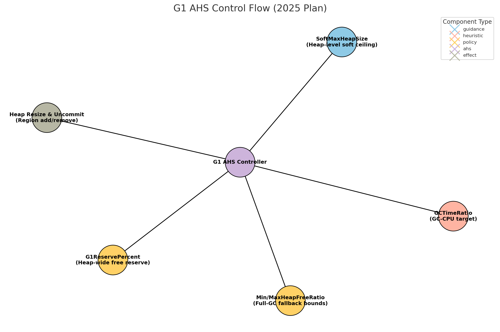
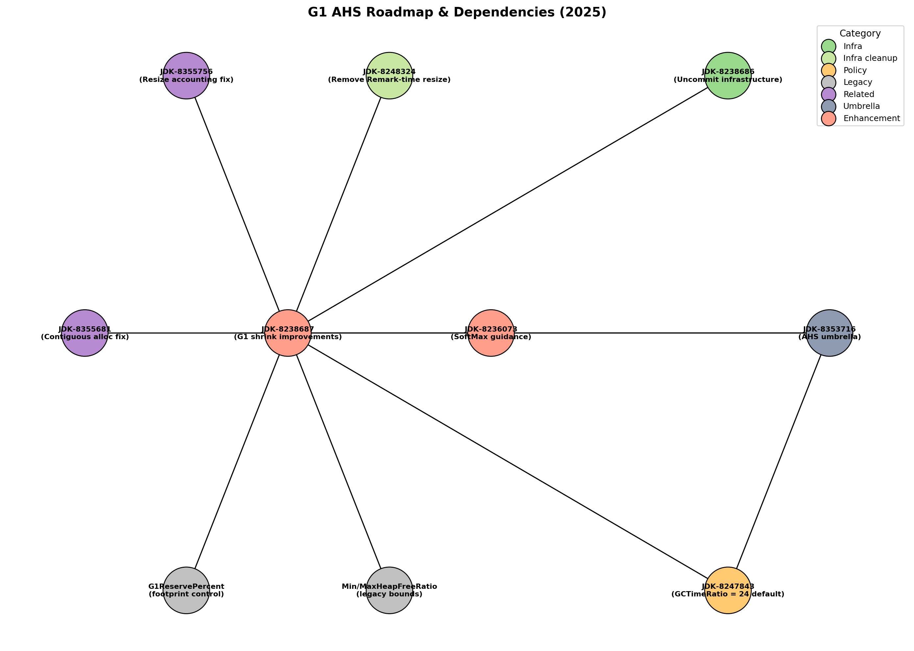

# State of Automatic Heap Sizing (AHS) for G1GC – April 2025

_Compiled by Monica Beckwith_

---

## 🧭 Executive Summary

With recent developments in G1GC’s shrinking infrastructure, `GCTimeRatio` tuning, and the integration of `SoftMaxHeapSize`, we are approaching a more unified and adaptive heap sizing strategy, where user signals and GC overhead together shape footprint and responsiveness. While not yet a fully cohesive control loop like in ZGC, the groundwork is actively being laid across several JDK enhancements.

This “State of AHS for G1” report summarizes the architectural direction, Microsoft’s position, and next steps to stabilize and refine G1’s Automatic Heap Sizing (AHS).

---

## ✅ Microsoft’s Position

| Mechanism               | Position                                                                 |
|-------------------------|--------------------------------------------------------------------------|
| `SoftMaxHeapSize`       | ✅ Valuable guidance signal; useful in containerized workloads           |
| `CurrentMaxHeapSize`    | 🚫 Not needed in our deployments; optional for niche use cases           |
| `GCTimeRatio`           | ✅ Foundational control; future: float + runtime-manageable              |
| `G1ReservePercent`      | ✅ Safety floor; required until an adaptive reserve is implemented       |
| `Min/MaxHeapFreeRatio`  | ✅ Retain for Full GC; agree with removal from Remark shrink             |
| `Uncommit behavior`     | ✅ Critical to ensure shrink translates into actual memory release       |

---

## 🔧 Component-by-Component Analysis

### `SoftMaxHeapSize`

Not a hard limit, but a **soft ceiling** for heap expansion.
- Useful for footprint-sensitive tuning.
- IHOP integration + PR [#24211](https://github.com/openjdk/jdk/pull/24211).
- Encouraged as a dynamic, tunable signal for AHS.

### `CurrentMaxHeapSize`

Not required in our containerized deployments (e.g., AKS/ACA).
- Resource limits enforced via cgroups (`memory.max`).
- May be useful for Google's custom container runtime, but we prefer it remain optional and **outside core AHS logic**.

### `GCTimeRatio`

A core signal for GC-time vs. mutator-time balancing.
- Change from 12 → 24 is welcome. We will do the stepped testing to ensure that this value is good for diverse applications.
- **Future work**: Make it runtime manageable and allow float inputs for better precision.

### `G1ReservePercent` (heap‑wide free‑region reserve)

Ensures **at least N % of regions stay free** to receive evacuated objects – a safety floor against to‑space exhaustion.  It is orthogonal to `SoftMaxHeapSize` (ceiling) and remains in AHS for robustness. **See the control-flow diagram for how this floor interacts with the AHS controller.**

### `Min/MaxHeapFreeRatio`

Removed from `Remark`-time shrink logic; still active after `Full GC` for predictable footprint trimming in legacy tuning.

- Still **very useful** for **explicit control** during Full GCs.
- Serve as **predictable and long-standing guardrails** for users not yet fully migrated to AHS.
- Can act as fallback tuning inputs where fixed expansion/shrinkage thresholds are desirable.

### Uncommit Infrastructure

Heap shrinking is effective only if memory is actually released.
- Critical to couple shrinking with memory uncommit behavior.
- Relevant issues include:
  - [JDK-8238686](https://bugs.openjdk.org/browse/JDK-8238686)
  - [JDK-8248324](https://bugs.openjdk.org/browse/JDK-8248324)
  - [JDK-8238687](https://bugs.openjdk.org/browse/JDK-8238687)

---

## 🔄 Architectural Control Flow

This diagram illustrates the evolving G1 heap control strategy:

---

## 📊 Dependencies and Enhancement Threads

Ongoing enhancements feeding into G1's AHS capabilities:

Key issues:
- [JDK-8238687: Shrink improvements](https://bugs.openjdk.org/browse/JDK-8238687):
  Refines the logic for heap shrinking to avoid pathological shrink-expand cycles and improve stability during contraction phases.
- [JDK-8238686: Uncommit infrastructure](https://bugs.openjdk.org/browse/JDK-8238686):
  Introduces and consolidates infrastructure needed to safely and efficiently uncommit memory across collection phases.
- [JDK-8247843: GCTimeRatio defaults](https://bugs.openjdk.org/browse/JDK-8247843):
  Revisits and adjusts default values for GCTimeRatio to better align with modern expectations of heap sizing and pause/throughput tradeoffs.
- [JDK-8236073: SoftMax guidance](https://bugs.openjdk.org/browse/JDK-8236073):
  Defines the role of SoftMaxHeapSize as a tunable signal to guide GC behavior and memory footprint, enabling more flexible heap sizing under pressure.
- [JDK-8353716: AHS coordination umbrella](https://bugs.openjdk.org/browse/JDK-8353716):
  Tracks the overarching effort to unify and streamline AHS mechanisms across G1GC. This includes coordinating heuristics and signals such as `SoftMaxHeapSize`, `GCTimeRatio`, GC overhead thresholds, and uncommit behavior to improve responsiveness to memory pressure and runtime conditions while avoiding pathological expansion/shrinkage cycles.
---

## 🔗 Related Work and References

- [ZGC SoftMaxHeapSize (Per Liden)](https://malloc.se/blog/zgc-softmaxheapsize)
- [AHS in ZGC – ACM 2023](https://dl.acm.org/doi/pdf/10.1145/3617651.3622988)
- [JDK-8236073](https://bugs.openjdk.org/browse/JDK-8236073)
- [JDK-8329758](https://bugs.openjdk.org/browse/JDK-8329758)
- [JDK-8204088](https://bugs.openjdk.org/browse/JDK-8204088)
- [G1ReservePercent adaptive reserve idea – hotspot‑gc‑dev thread, May 2025](https://mail.openjdk.org/pipermail/hotspot-gc-dev/2025-May/052193.html)

---

## 🛠️ Next Steps and Opportunities

- Validate `GCTimeRatio=24` across representative workloads
- Encourage runtime manageability of `GCTimeRatio` and `SoftMaxHeapSize`
- Monitor [PR #24211](https://github.com/openjdk/jdk/pull/24211) and IHOP behavior under load
- Clarify priorities and precedence among tuning knobs (SoftMax, G1ReservePercent, etc.)
- Continue coordinating AHS under umbrella [JDK-8353716](https://bugs.openjdk.org/browse/JDK-8353716)

---

_Contributed by [@mo-beck](https://github.com/mo-beck) • April 2025_